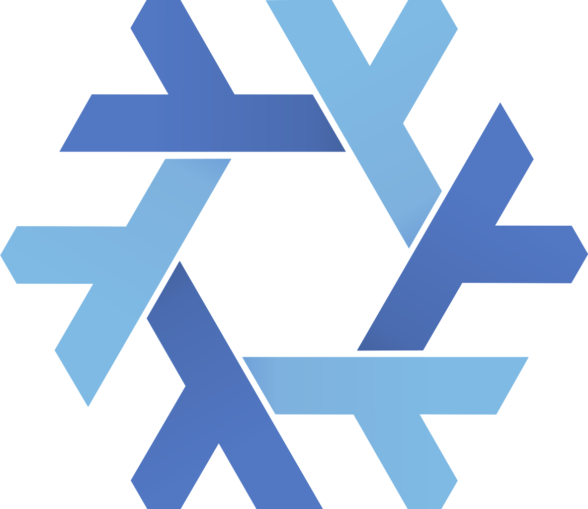

<h1 align="center">
    Hi there, welcome to my profile 
</h1>

    
    
    
    
    
    
    
    
     
    
    
    
       

# Quick Facts:

- 🎓 Senior at Virginia Commonwealth University (VCU), graduating Spring 2026
- 💻 Full-stack software developer with experience in WebDev and DevOps
- 👨🏽‍💻 Working @Psynk.ai as a Full-Stack Developer and Front-End Lead
- 🐧 Linux enthusiast who maintains several servers with complex Nix configurations
-  Proud parent of two cats named after Metroid: Emmi and Kohzo
-  Currently creating my own Nix Library, [mix.nix](https://github.com/TophC7/mix.nix) ; for building opinionated NixOS configurations
- 🚀 Always exploring new technologies and open source projects

# My Mods:

- ⛏️ [Excavate](https://github.com/TophC7/Excavate) — NeoForge 1.21.1 enchantment mod that adds area mining (3x3 and 5x5) to any pickaxe, axe, shovel, or hoe
- 🎮 [Mimecraf](https://github.com/TophC7/mimecraf) — An early Minecraft mod project